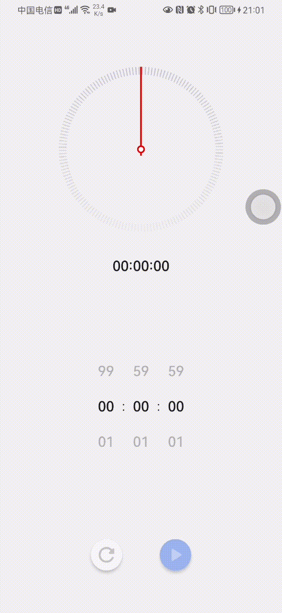

### 介绍
以华为系统计时器为原型，使用compose实现的计时器。

### 参考
[NumberPicker](https://github.com/ChargeMap/Compose-NumberPicker)
[Jetpack compose](https://blog.csdn.net/c10WTiybQ1Ye3/article/details/114609004)

### 预览

